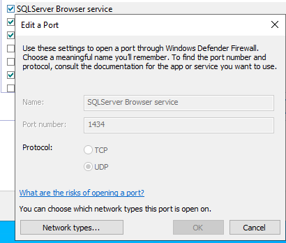
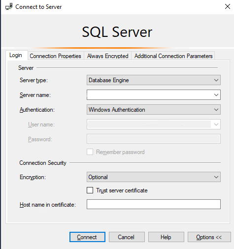

# SQL Server 2022 Developer on Windows Server 2022 Datacenter

## Quick Start Guide

Welcome to SQL Server 2022 Developer on Windows Server 2022 Datacenter! This guide will help you get started with your new SQL Server Developer instance on Google Cloud Platform

### Table of Contents

- [SQL Server 2022 Developer on Windows Server 2022 Datacenter](#sql-server-2022-developer-on-windows-server-2022-datacenter)
  - [Quick Start Guide](#quick-start-guide)
    - [Table of Contents](#table-of-contents)
    - [Introduction](#introduction)
      - [Key Features](#key-features)
      - [SQL Patch Level](#sql-patch-level)
    - [Prerequisites](#prerequisites)
    - [Installation](#installation)
  - [Before You Get Started](#before-you-get-started)
    - [Enabling TCP/IP Protocol](#enabling-tcpip-protocol)
    - [Firewall](#firewall)
  - [Connecting to SQL Server via SSMS](#connecting-to-sql-server-via-ssms)
  - [Connecting to SQL Server via sqlcmd](#connecting-to-sql-server-via-sqlcmd)
  - [Authentication](#authentication)
  - [Testing the Installation](#testing-the-installation)

### Introduction

This guide provides step-by-step instructions to quick start with SQL Server 2022 Developer on Windows Server 2022 Datacenter at Google Cloud Platform.
You will have following within this bundle:

#### Key Features
| Feature                      | Description                                          |
|------------------------------|------------------------------------------------------|
| OS version                   | Microsoft Windows Server 2022 Datacenter (10.0.20348)|
| SQL Package                  | Microsoft SQL Server 2022                            |
| SQL Edition                  | Developer                                            |
| Type                         | RTM-CU13 (KB5036432)                                 |
| Version                      | 16.0.4125.3 (X64)                                    |
| Features                     | Database Engine Services, SSIS, SSAS                 |
| Deafult Instance             | MSSQLSERVER                                          |
| Clustered                    | No                                                   |

#### SQL Patch Level
KB5036432 - Cumulative Update 13 for SQL Server 2022
This update contains 15 [fixes](https://learn.microsoft.com/en-us/troubleshoot/sql/releases/sqlserver-2022/cumulativeupdate13#improvements-and-fixes-included-in-this-update) that were issued after the release of SQL Server 2022 Cumulative Update 12, and it updates components in the following builds:

SQL Server - Product version: 16.0.4125.3, file version: 2022.160.4125.3
Analysis Services - Product version: 16.0.43.233, file version: 2022.160.43.23
[Learn more](https://learn.microsoft.com/en-us/troubleshoot/sql/releases/sqlserver-2022/cumulativeupdate13)

### Prerequisites

- A Google Cloud Platform account.
- Basic knowledge of SQL Server

### Installation

1. **Deploy the Image**: Follow the instructions on the [Google Cloud Platform Marketplace](https://console.cloud.google.com/marketplace/product/gclouds-public/sql-server-2022-developer-on-windows-server-2022-datacenter?project=gclouds-public) to deploy the SQL Server 2022 Developer image.
2. **Access the SQL Server as an Administrator**: Access your Windows Server instance using Remote Desktop Protocol (RDP) with an administrator user.

***Create a Windows administrator user on the server by setting a password.***


[Learn more](https://cloud.google.com/compute/docs/instances/windows/generating-credentials) about managing accounts and credentials on Windows VMs. 

## Before You Get Started
Before you can connect to your SQL Server instance from another machine, you will need to complete the following tasks:
- Set default port TCP/IP protocol for the named SQL Server instance
- Create firewall rules for the required ports
- Create the necessary logins for SQL Server

### Enabling TCP/IP Protocol
TCP/IP server network protocol is required to connect to this SQL Server instance from a remote machine. This requires enabling TCP/IP protocol for the SQL Server service. 
> Note: TCP/IP protocol has already been enabled on the deployed server.

### Firewall
To access an instance of the SQL Server through a firewall, you must configure the firewall on the computer that is running SQL Server to allow access. The firewall is a component of Microsoft Windows. You can also install a firewall from another company.

You can use the `Powershell` to create the necessary exceptions to allow connections to the SQL Server instance.

An example of a command allowing the named instance TCP port of 1433 to be used is shown below.
- `tcp`
    ```powershell
          New-NetFirewallRule -DisplayName "SQLServer MSSQLSERVER default instance" -Direction Inbound -LocalPort 1433 -Protocol TCP -Action Allow
    ```
- `udp` *optional*
    ```powershell
          New-NetFirewallRule -DisplayName "SQLServer Browser service" -Direction Inbound -LocalPort 1434 -Protocol UDP -Action Allow
    ```



> Note: These firewall configuration steps have already been taken care of in deployed SQL Server.

## Connecting to SQL Server via SSMS

1. **Open SQL Server Management Studio (SSMS)**: Launch SSMS on the server as an administrator.


1. **Connect to the Server**:
   - **Server Name**: Use the IP address or the hostname of your Windows Server instance.
   - **Authentication**: Choose the Windows Authentication method
   - 
2. **Verify the Connection**: Ensure that you can connect to the `MSSQLSERVER` instance
3. **Execute a sample SQL Query**
```sql
SELECT name FROM sys.databases WHERE database_id <= 4;
GO
```


## Connecting to SQL Server via sqlcmd

1. **Open a command prompt.**: Launch cmd on the server 
2. **Change Directory.**: C:\Program Files\Microsoft SQL Server\Client SDK\ODBC\170\Tools\Binn>
3. **Run sqlcmd prompt**:Enter sqlcmd to start the SQL command-line tool. 
    At the sqlcmd prompt (1>), type the following query and press Enter:
```sql
SELECT name FROM sys.databases WHERE database_id <= 4;
GO
```
***Output***
```sql
name                                                                                                                    
--------------------------------
master                                                                                                                  
tempdb                                                                                                                  
model                                                                                                                   
msdb                                                                                                                    

(4 rows affected)
```

## Authentication
As part of this packaged installation, the account running the SQL Server setup `BUILTIN/Administrators` has system administrator (sysadmin) privileges on the SQL Server. In case you need to add another Windows user as a system administrator, then this can be done using the following example.

```sql
CREATE LOGIN [<domainName>\<loginName>] FROM WINDOWS;
GO
ALTER SERVER ROLE sysadmin ADD MEMBER [<domainName>\<loginName>];
GO
```
## Testing the Installation

To verify that SQL Server is running correctly, you can perform the following tests:

1. **Check SQL Server Services**: Ensure that the SQL Server is running. SQL Server Browser services is disabled.
2. **Run a Simple Query**: Open SSMS and run a sample query to test the connection and functionality:
   ```sql
     SELECT @@VERSION
     GO
   ```
